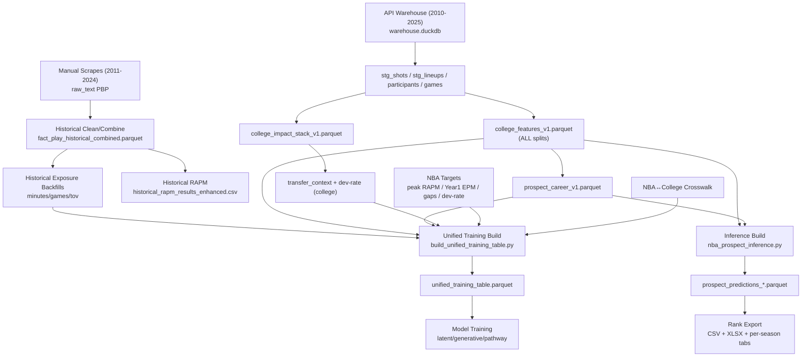

<!-- CANONICAL_HTML_MIRROR -->
# Markdown Mirror

This file is a mirror. Canonical visual artifact: `/Users/akashc/my-trankcopy/ml model/docs/diagrams/layered_execution_dashboard.html`

Summary: Layered runbook DAG mirrored; stage gates and hard-stop policy canonicalized in HTML.

Last mirror refresh: 2026-02-21 13:38:05


# Markdown Mirror

This file is a mirror. Canonical visual artifact: `/Users/akashc/my-trankcopy/ml model/docs/diagrams/layered_execution_dashboard.html`

Summary: Layered runbook DAG mirrored; stage gates and hard-stop policy canonicalized in HTML.

Last mirror refresh: 2026-02-20 20:55:19


# Markdown Mirror

This file is a mirror. Canonical visual artifact: `/Users/akashc/my-trankcopy/ml model/docs/diagrams/layered_execution_dashboard.html`

Summary: Layered runbook DAG mirrored; stage gates and hard-stop policy canonicalized in HTML.

Last mirror refresh: 2026-02-20 20:52:26


# Markdown Mirror

This file is a mirror. Canonical visual artifact: `/Users/akashc/my-trankcopy/ml model/docs/diagrams/layered_execution_dashboard.html`

Summary: Layered runbook DAG mirrored; stage gates and hard-stop policy canonicalized in HTML.

Last mirror refresh: 2026-02-20 19:18:17


# Markdown Mirror

This file is a mirror. Canonical visual artifact: `/Users/akashc/my-trankcopy/ml model/docs/diagrams/layered_execution_dashboard.html`

Summary: Layered runbook DAG mirrored; stage gates and hard-stop policy canonicalized in HTML.

Last mirror refresh: 2026-02-20 11:52:26


# Markdown Mirror

This file is a mirror. Canonical visual artifact: `/Users/akashc/my-trankcopy/ml model/docs/diagrams/layered_execution_dashboard.html`

Summary: Layered runbook DAG mirrored; stage gates and hard-stop policy canonicalized in HTML.

Last mirror refresh: 2026-02-20 11:51:36


# Markdown Mirror

This file is a mirror. Canonical visual artifact: `/Users/akashc/my-trankcopy/ml model/docs/diagrams/layered_execution_dashboard.html`

Summary: Layered runbook DAG mirrored; stage gates and hard-stop policy canonicalized in HTML.

Last mirror refresh: 2026-02-20 11:50:14


# Markdown Mirror

This file is a mirror. Canonical visual artifact: `/Users/akashc/my-trankcopy/ml model/docs/diagrams/layered_execution_dashboard.html`

Summary: Layered runbook DAG mirrored; stage gates and hard-stop policy canonicalized in HTML.

Last mirror refresh: 2026-02-20 11:18:49


# College→NBA Full Pipeline (Layered DAG + Runbook)

Date: 2026-02-19  
Scope: full data-to-model pipeline, strict gates, current source priorities, and execution layering.  
Audience: Antigravity + engineering review.

---

## 1) System DAG (Top-Level)



---

## 2) Source-of-Truth Priority (Critical)

### Exposure (games/minutes/tov) priority
1. Manual-historical substitution/lineup reconstruction backfill (best for historical seasons).
2. Historical text-games backfill (`fact_play_historical_combined.parquet`, game counts by player mention).
3. API-derived/event-derived counts (`derived_box_stats_v1.parquet`) as fallback only.

### Why this matters
- Event-participation counts can undercount real appearances for some players/seasons.
- `onFloor` can be team-placeholder in historical data, which breaks direct minutes derivation.
- Never treat a single weak source as canonical without spot-checks.

---

## 3) Layered Execution Model

## L0: Input Freeze + Snapshot
- Freeze row counts, schemas, uniqueness, null-rates.
- Artifacts:
  - `data/audit/stage0_input_snapshot.json`

## L1: Historical Reconstruction Layer
- Build/refresh historical combined PBP.
- Build historical RAPM.
- Build historical exposure backfills (minutes/games/tov) from manual/historical sources.
- Artifacts:
  - `data/fact_play_historical_combined.parquet`
  - `data/historical_rapm_results_enhanced.csv`
  - `data/warehouse_v2/fact_player_season_stats_backfill*.parquet`

## L2: College Feature Layer
- Build/refresh:
  - `college_features_v1.parquet`
  - `college_impact_stack_v1.parquet`
  - `fact_player_transfer_context.parquet`
  - `fact_player_college_development_rate.parquet`
  - `prospect_career_v1.parquet`
  - `trajectory_stub_v1.parquet`

## L3: NBA Target Layer
- Validate and dedupe target contracts:
  - `fact_player_peak_rapm.parquet` (unique `nba_id`)
  - `fact_player_year1_epm.parquet`
  - `fact_player_nba_college_gaps.parquet`
  - `fact_player_development_rate.parquet`

## L4: Linkage Layer
- Crosswalk join quality and ambiguity checks:
  - `dim_player_nba_college_crosswalk.parquet`

## L5: Unified Table Layer
- Build final training matrix:
  - `data/training/unified_training_table.parquet`
- Enforce:
  - unique `nba_id`
  - `draft_year_proxy >= 2011`
  - no critical missing columns

## L6: Gate + Validation Layer
- Run strict checks:
  - schema/cardinality/coverage/distribution/contract
- Run tests:
  - `tests/test_wiring_edge_cases.py`
  - `tests/test_dev_rate_label_math.py`
  - `tests/test_encoder_gating.py` (when required)
  - `tests/quick_validate.py`

## L7: Train Layer
- Trainers:
  - latent
  - generative
  - pathway
- Preserve calibration artifacts.

## L8: Inference + Export Layer
- Build inference table and score all prospects.
- Always export:
  - all-player CSV
  - qualified CSV
  - XLSX tabs
  - per-season CSVs

---

## 4) Command Runbook (Current)

### 4.1 Historical + Features
```bash
python3 ml\ model/college_scripts/calculate_historical_rapm.py
python3 ml\ model/college_scripts/build_college_impact_stack_v1.py
python3 ml\ model/college_scripts/build_transfer_context_v1.py
python3 ml\ model/college_scripts/build_fact_player_college_development_rate.py
python3 ml\ model/college_scripts/build_prospect_career_store_v2.py
python3 ml\ model/nba_scripts/build_trajectory_stub.py
```

### 4.2 Unified + Gates
```bash
python3 ml\ model/nba_scripts/build_unified_training_table.py
python3 ml\ model/nba_scripts/run_nba_pretrain_gate.py
python3 ml\ model/scripts/run_missing_data_audit.py --db data/warehouse.duckdb --audit-dir data/audit --start-season 2023 --end-season 2025 --prefer-manual-for-subs-lineups --subs-lineups-api-min-season 2024 --prefer-manual-for-plays-participants
```

### 4.3 Tests
```bash
pytest -q ml\ model/tests/test_wiring_edge_cases.py ml\ model/tests/test_dev_rate_label_math.py
python3 ml\ model/tests/quick_validate.py
```

### 4.4 Training
```bash
python3 ml\ model/nba_scripts/train_latent_model.py
python3 ml\ model/nba_scripts/train_generative_model.py
python3 ml\ model/nba_scripts/train_pathway_model.py --skip-diagnostics
```

### 4.5 Inference (auto-exports CSV+XLSX)
```bash
python3 ml\ model/nba_scripts/nba_prospect_inference.py --model-path ml\ model/models/<latent_model_timestamp>/model.pt
```

---

## 5) Output Contracts (Current)

## Unified training
- `ml model/data/training/unified_training_table.parquet`
- must include:
  - primary/aux targets
  - full encoder feature surface
  - cohort columns (`draft_year`, `rookie_season_year`, `draft_year_proxy`)

## Inference outputs
- `ml model/data/inference/prospect_predictions_<timestamp>.parquet`
- includes:
  - `pred_peak_rapm`, `pred_peak_rapm_rank_score`
  - `pred_dev_rate`, `pred_dev_rate_std`

## Exported rankings (always)
- `ml model/data/inference/season_rankings_latest_best_current.csv` (all players)
- `ml model/data/inference/season_rankings_latest_best_current_qualified.csv`
- `ml model/data/inference/season_rankings_top25_best_current_tabs.xlsx`
- `ml model/data/inference/season_rankings_top25_best_current_by_season_csv/*`

---

## 6) Qualification + Visibility Policy

- Main CSV is all-player (never hide players).
- Qualified CSV is strict exposure subset.
- Rank fields:
  - `season_rank_all`
  - `season_rank_qualified`
- Exposure transparency:
  - `college_games_played`
  - `college_minutes_total`
  - `college_minutes_total_raw`
  - `minutes_is_estimated`

---

## 7) Bayesian Active-Learning Loop (Year-over-Year)

Target behavior:
1. Fit season `S` with priors learned from `< S`.
2. Update posterior for season `S`.
3. Carry posterior forward into `S+1`.
4. Continue 2012 → 2024.

Benefits:
- captures era drift (inflation/deflation)
- avoids static one-shot coefficients
- preserves uncertainty through time

Current status:
- sequential Bayesian reliability scoring is active in inference ranking.
- strict full posterior handoff across all submodules is partially implemented and should be treated as ongoing hardening work.

---

## 8) Hard Stops vs Non-Critical

## Hard stop
- duplicate keys on target tables
- missing critical DAG inputs
- missing encoder-required columns
- catastrophic target coverage regression

## Non-critical (log + continue)
- wingspan sparsity
- legacy `gap_usg_legacy` sparsity
- optional experimental auxiliaries

---

## 9) Known Risk Areas (as of 2026-02-19)

1. Historical true minutes:
- some historical sources still lack stable per-player lineup identity in `onFloor`.
- substitution/text reconstruction is required to turn estimated minutes into true raw minutes at scale.

2. Name-matching ambiguity:
- apostrophes/hyphens/suffixes can still produce alias collisions if not tightly constrained by season/team context.

3. Cross-source conflicts:
- multiple backfill sources may disagree; source-priority and deterministic merge rules must remain explicit.

---

## 10) Immediate Next Layer (if continuing now)

1. Complete substitution-driven true-minute reconstruction and write canonical backfill.
2. Rebuild unified + inference using true raw minutes (reduce `minutes_is_estimated`).
3. Re-run strict gates and test battery.
4. Re-train latent model on updated exposure signals.

---

## 11) Quick “What Runs When” Summary

1. Reconstruct/refresh historical sources.  
2. Rebuild college feature/career/impact/dev artifacts.  
3. Rebuild unified training table.  
4. Run strict tests/gates.  
5. Train models.  
6. Run inference (auto exports CSV + XLSX).  
7. Audit outputs and publish readiness.

