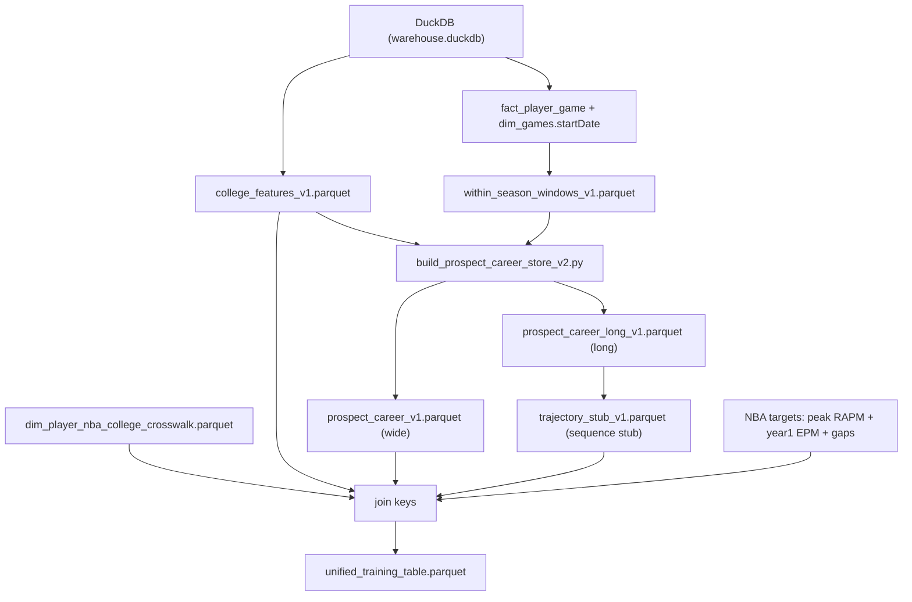
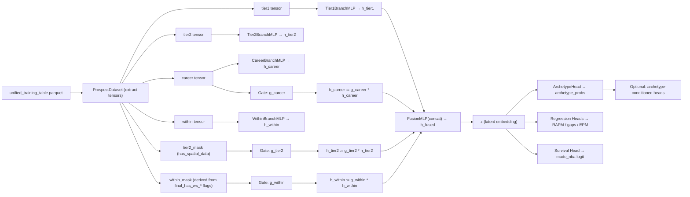

# Prospect Model Connectivity Proposal (Full Inputs, Full DAG)

**Date**: 2026-02-03  
**Default Archetype Mix**: cumulative=0.85, max_k=3  
**Scope**: Draft-time safe (college → NBA targets only), mask-safe (no fake zeros), handles transfers + variable career lengths.

This is a proposal-style document that explains, in explicit detail:
1. **Every model input column** and which “branch” it feeds.
2. The **exact arrows** from parquet → tensors → encoder branches → gates → latent `z` → heads → outputs.
3. The rationale behind each connection (why this, why not something else).

If you only read one thing:
- **Explicit inputs** (verbatim column list): `docs/full_input_columns.md`  
- **This doc** explains how those inputs connect and why.

---

## 0) Source Of Truth (Non-Negotiable)

To avoid “docs drifting from code” we treat these as authoritative:

1. **Actual built training table**: `data/training/unified_training_table.parquet`
2. **Verified explicit column report**: `docs/full_input_columns.md` (generated by `nba_scripts/emit_full_input_dag.py`)
3. **Model input lists (code)**:
   - `models/player_encoder.py`: `TIER1_COLUMNS`, `TIER2_COLUMNS`, `CAREER_BASE_COLUMNS`, `WITHIN_COLUMNS`

This proposal describes the *connectivity*, but the above items define the *actual inputs*.

---

## 1) End-To-End DAG (Data → Model → Outputs)

### 1.1 Data Assembly DAG (Parquets)

### 1.2 Modeling DAG (Tensors + Branches + Gates)

---

## 2) Inputs → Branches (Exact Column Names)

The goal is that **every input has a clear “why”** and a clear branch destination.

### 2.1 Tier 1 Branch: Final-Season Snapshot + Safe Context Anchors (`h_final`)

Tier 1 is the “draft class snapshot”: what the player looked like at the end of college.

**Shotmaking / efficiency:**
- `college_rim_fg_pct`
- `college_mid_fg_pct`
- `college_three_fg_pct`
- `college_ft_pct`

**Shot diet / attempt mix:**
- `college_rim_share`
- `college_mid_share`
- `college_three_share`

**Volume / role / exposure:**
- `college_shots_total`
- `college_fga_total`
- `college_ft_att`
- `college_minutes_total`

**Context proxies (calibration, not “credit”):**
- `college_team_pace`
- `college_is_power_conf`

**Possession economy / ancillary value (RAPM-adjacent signals):**
- `college_ast_total_per40`
- `college_tov_total_per40`
- `college_stl_total_per40`
- `college_blk_total_per40`

**Era normalization (drift mitigation):**
- `college_three_fg_pct_z`
- `college_three_share_z`
- `final_trueShootingPct_z`
- `final_usage_z`

**Team-context residuals (player vs team environment):**
- `final_trueShootingPct_team_resid`
- `final_usage_team_resid`

**Why these exist (tying to your “materials”):**
- This branch captures the “possession economy + shot diet + functional activity” mindset
  (without hard-coding thresholds).
- The z-scores and residuals address the “2010 standards vs 2025 standards” issue.

### 2.2 Tier 2 Branch: Spatial/Shot Quality Details (`h_spatial`)

Tier 2 exists because spatial is **not** available uniformly across all seasons.

Inputs:
- `college_avg_shot_dist`
- `college_shot_dist_var`
- `college_corner_3_rate`
- `college_corner_3_pct`
- `college_deep_3_rate`
- `college_rim_purity`
- `college_xy_shots`
- `college_xy_3_shots`
- `college_xy_rim_shots`

Mask:
- `has_spatial_data` → `tier2_mask`

**Rule:** Tier 2 is never “faked.” Missing spatial is masked and replaced by a **learned default embedding**.

### 2.3 Career Branch: Multi-Season Progression (`h_career`)

This branch is how we handle:
- 1-and-dones vs 4-year players
- transfers
- late bloomers vs early producers

Inputs (exact names):
- `career_years`
- `final_trueShootingPct`, `final_usage`, `final_poss_total`
- `final_rim_fg_pct`, `final_three_fg_pct`, `final_ft_pct`
- `slope_trueShootingPct`, `slope_usage`
- `career_wt_trueShootingPct`, `career_wt_usage`
- `delta_trueShootingPct`, `delta_usage`
- `breakout_timing_avg`, `breakout_timing_volume`, `breakout_timing_eff`

**Interpretation:**
- `breakout_timing_*` is “career-stage” timing (freshman→senior axis).
- It addresses the “late/early breakout” concept *continuously* (no rules).

### 2.4 Within-Season Branch: “Star Run” / Late-Season Form (`h_within`)

This branch is the *within-season* axis (conference play / March form).

Inputs:
- `final_has_ws_last10`
- `final_ws_minutes_last10`
- `final_ws_pps_last10`
- `final_ws_delta_pps_last5_minus_prev5`
- `final_has_ws_breakout_timing_eff`
- `final_ws_breakout_timing_eff`

Mask:
- `within_mask` is derived from the explicit window flags:
  - `final_has_ws_last5`
  - `final_has_ws_last10`
  - `final_has_ws_breakout_timing_eff`

**Rule:** if the game log coverage is sparse, these remain `NaN` in storage and become
`0` only at tensor conversion time *together with mask=0*, so the branch is gated out.

This resolves the exact confusion from your comment:
- “1/3 through freshman year” is within-season timing.
- “1/3 through a 4-year career” is career-stage timing.
- We do **not** collapse them into one number.

### 2.5 Not Yet Implemented (Planned Branches)

**Physical / measurements** (`h_phys`):
- join combine/bio when available via `nba_id` (draft-time safe)
- missingness mask for prospects without `nba_id`

**Opponent strength / stress testing** (`h_competition`):
- per-game weighting vs top-220 / tiers (needs richer game/opponent coverage)

---

## 3) Gating Logic (Prevent Tiny-Sample Dominance)

The core failure mode we’re preventing:
- a player goes hot for 3–7 games → within-season features explode → the model overreacts

### 3.1 What We Gate Today (Phase 1.5)

Implemented in `models/player_encoder.py`:
- `g_tier2 = sigmoid(Linear(tier2_mask))`
- `g_career = sigmoid(Linear(log1p(career_years)))`
- `g_within = sigmoid(Linear([within_mask, log1p(ws_minutes_last10)]))`

And then we apply:
- `h_tier2 := g_tier2 * h_tier2`
- `h_career := g_career * h_career`
- `h_within := g_within * h_within`

Tier 1 is not gated (it’s the anchor snapshot).

### 3.2 Why This Is “Nuanced” (Not Mud)

We’re not just concatenating everything and hoping.

We’re explicitly telling the model:
- **optional sources** exist,
- their reliability varies,
- and reliability should modulate influence.

This is the “correct” way to incorporate late/early breakouts without hard rules.

### 3.3 What We Will Improve Next (Phase 2)

Right now gates are intentionally tiny (few inputs) to avoid adding a second model.

Next upgrades (once you like the behavior):
1. Add exposure signals: `final_games_played`, `final_poss_per_game`, etc.
2. Position-bucketed gating (guards/bigs react differently to the same “star run” signal).
3. Optional archetype-aware gating (requires care to avoid circularity).

---

## 4) Archetypes: Soft Matching + “Late Breakout Matters More For Some Types”

### 4.1 Soft Matching (No Over-Match)

We always expose a mixture, not a hard label:
- cumulative probability ≥ 0.85
- at most 3 archetypes

This is implemented in:
- `models/archetype_analyzer.py`
- `nba_scripts/nba_prospect_inference.py`

### 4.2 “Breakout Importance Varies By Prototype”

We do *not* hard-code that “late breakouts are bad.”

Instead:
- the encoder produces `z` from all branches + gates,
- the archetype head produces `archetype_probs`,
- the outcome heads can optionally condition on `archetype_probs`.

So the model can learn patterns like:
- for archetype A, late-season form is highly predictive
- for archetype B, late-season form is noise

That’s the correct version of “late/early breakout matters more for some prototypes.”

---

## 5) Boundary Cases (How The DAG Handles Them)

### 5.1 Transfers (multi-team in one season)

Upstream behavior (already implemented in the training-table builder):
- aggregate same-season multi-team rows (counts sum)
- select `college_teamId` from max-minutes team for team-context residuals

Model impact:
- Tier 1 remains a valid snapshot
- team residuals remain meaningful

### 5.2 UDFAs / Missing `nba_id`

Inference path does **not** require `nba_id`.

Model impact:
- physical branch is absent anyway (planned)
- Tier 1 + career + optional within still work

### 5.3 Sparse Game Logs (within-season windows missing)

If we lack `fact_player_game` coverage:
- within-season features are `NaN` in parquet
- in tensors they become 0 **but within_mask=0**
- within branch is replaced by a learned default and gated ~0

So we do not accidentally “add 0s” as if the player had a real zero performance.

---

## 6) What We Are *Not* Using From NBA Data (By Design)

NBA warehouse tables are used as **targets only**.

We explicitly forbid:
- any year-1 box stats / EPM inputs
- identity columns as features

See:
- `nba_scripts/nba_data_loader.py` (`FORBIDDEN_FEATURE_COLUMNS`)
- `docs/end_to_end_wiring.md`

---

## 7) Next Steps (Concrete)

1. Train a small run of the latent model and inspect:
   - archetype stability
   - whether `h_within` is properly downweighted when `ws_minutes_last10` is tiny
2. If behavior looks good, expand within-season coverage by ingesting more `fact_player_game`.
3. Add physical branch (`h_phys`) as a purely optional “ceiling constraints” input.

