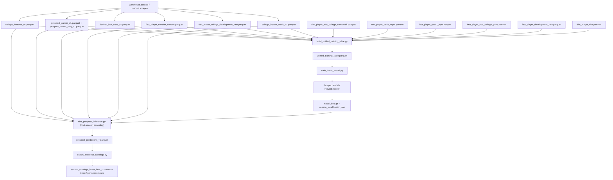

<!-- CANONICAL_HTML_MIRROR -->
# Markdown Mirror

This file is a mirror. Canonical visual artifact: `/Users/akashc/my-trankcopy/ml model/docs/diagrams/input_data_contract_dashboard.html`

Summary: Input contract DAG mirrored; canonical contract in HTML dashboard.

Last mirror refresh: 2026-02-20 20:55:19

# Markdown Mirror

This file is a mirror. Canonical visual artifact: `/Users/akashc/my-trankcopy/ml model/docs/diagrams/input_data_contract_dashboard.html`

Summary: Input contract DAG mirrored; canonical contract in HTML dashboard.

Last mirror refresh: 2026-02-20 20:52:26

# Markdown Mirror

This file is a mirror. Canonical visual artifact: `/Users/akashc/my-trankcopy/ml model/docs/diagrams/input_data_contract_dashboard.html`

Summary: Input contract DAG mirrored; canonical contract in HTML dashboard.

Last mirror refresh: 2026-02-20 19:18:17

# Markdown Mirror

This file is a mirror. Canonical visual artifact: `/Users/akashc/my-trankcopy/ml model/docs/diagrams/input_data_contract_dashboard.html`

Summary: Input contract DAG mirrored; canonical contract in HTML dashboard.

Last mirror refresh: 2026-02-20 11:52:26

# Markdown Mirror

This file is a mirror. Canonical visual artifact: `/Users/akashc/my-trankcopy/ml model/docs/diagrams/input_data_contract_dashboard.html`

Summary: Input contract DAG mirrored; canonical contract in HTML dashboard.

Last mirror refresh: 2026-02-20 11:51:36

# Markdown Mirror

This file is a mirror. Canonical visual artifact: `/Users/akashc/my-trankcopy/ml model/docs/diagrams/input_data_contract_dashboard.html`

Summary: Input contract DAG mirrored; canonical contract in HTML dashboard.

Last mirror refresh: 2026-02-20 11:50:14

# Markdown Mirror

This file is a mirror. Canonical visual artifact: `/Users/akashc/my-trankcopy/ml model/docs/diagrams/input_data_contract_dashboard.html`

Summary: Input contract DAG mirrored; canonical contract in HTML dashboard.

Last mirror refresh: 2026-02-20 11:18:49

# Current Input DAG (As-Wired)

This is the **current implementation DAG**, aligned to active code and table surfaces.

## End-to-end graph

## Active encoder branches
- `Tier1`:
  - shot profile + volume + context
  - per-100 activity rates
  - assisted-share
  - era z-scores
  - team residuals
  - recruiting priors
- `Tier2`:
  - spatial shot geometry (mask-gated)
- `Career`:
  - final anchors
  - slopes / recency-weighted means / deltas
  - breakout timing/rank features
  - dev-rate summaries
  - transfer summaries
  - explicit year context (`college_final_season`, `draft_year_proxy`)
- `Within`:
  - final within-season window features (mask-gated)

## Targets and supervision (no leakage into X)
- Primary: `y_peak_ovr`
- Aux: `gap_ts_legacy`, `year1_epm_tot`, `dev_rate_y1_y3_mean`, `made_nba`
- Year-1 NBA interactions are used as gated auxiliary pathway, not draft-time inputs.

## Known gaps from docs vs current data
- True `age_at_season` / `class_year` are still not present in active assembled surfaces.
- Within-season fields are currently populated but mostly zero-valued in training rows (source population gap).
- `breakout_timing_eff` is effectively dead (all-zero in current unified table).

## Ranking behavior (current)
- Raw model output is preserved: `pred_peak_rapm`.
- Rank score is learned with a small ridge meta-layer on known NBA outcomes:
  - base model outputs + survival probability + exposure terms.
- Exported rankings are now **qualified-pool only by default** (no 0-game rows in primary output).
