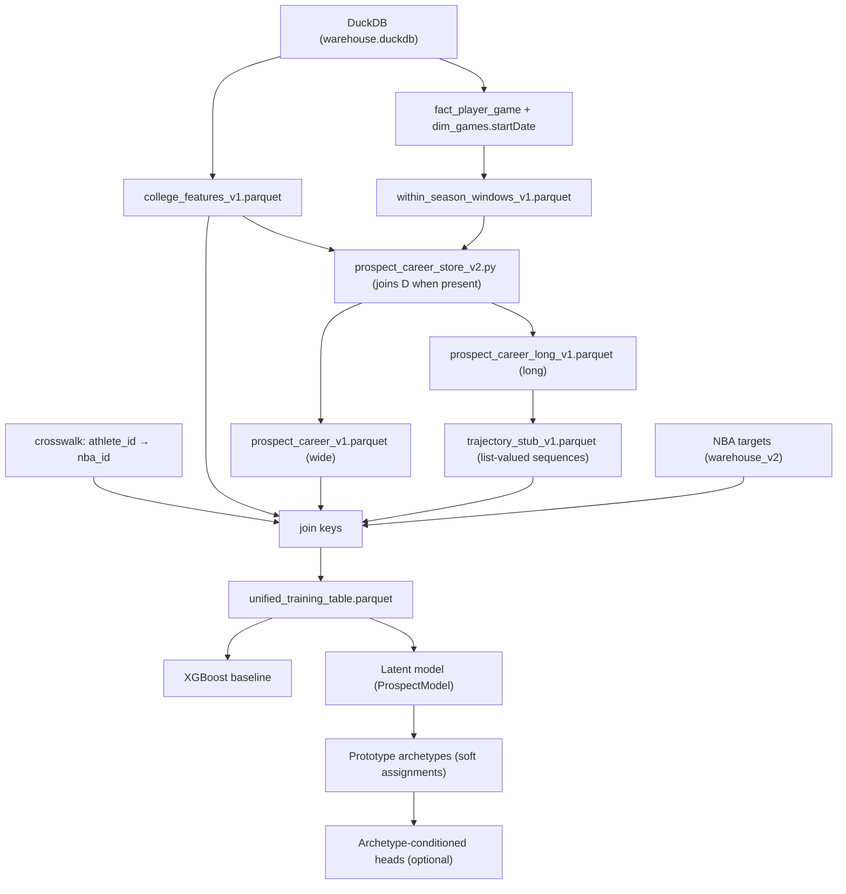

# Data Assembly + Model Connectivity Plan (Nuanced, Not “Mud at Wall”)

**Date**: 2026-02-03  
**Default Archetype Mix**: cumulative=0.85, max_k=3

This document describes how we assemble college + NBA supervision data and how we connect inputs (final season, career, within-season, physical/context) into a latent model in a principled way.

## 1) Goals

1. **Draft-time safe inputs** only (no post-draft leakage).
2. Handle **variable careers** (one-and-done, transfers, 4-year, late bloomers).
3. Handle **within-season form** (late-season “star run”) without overfitting.
4. Make archetypes interpretable and avoid **over-matching**: show top archetype mixture, not a single label.
5. Build a modular system where missingness stays **NaN + mask** (never fake zeros).

## 2) What Exists Today (Verified Wiring)

Canonical docs:
- `docs/end_to_end_wiring.md` (high-level wiring + leakage rules)
- `docs/full_input_columns.md` (explicit verified column list pulled from the built training table)

Key scripts:
- Training table: `nba_scripts/build_unified_training_table.py`
- Career store: `college_scripts/build_prospect_career_store_v2.py`
- Within-season windows: `college_scripts/build_within_season_windows_v1.py`
- Inference (no nba_id required): `nba_scripts/nba_prospect_inference.py`

Archetype mix output:
- Analyzer narrative: `models/archetype_analyzer.py`
- Inference parquet: `archetype_top_ids`, `archetype_top_probs`

## 2.1) How *Current* Model Inputs Map Into The Connectivity Plan

You’re right to call this out: Section 4 describes the *intended* “typed branches”
(`h_final`, `h_career`, `h_within`, `h_phys`, `h_context`). This section maps
**every column the latent model actually consumes today** into the connectivity plan.

Source of truth:
- `models/player_encoder.py` (`TIER1_COLUMNS`, `TIER2_COLUMNS`, `CAREER_BASE_COLUMNS`, `WITHIN_COLUMNS`)
- `docs/full_input_columns.md` (verifies those columns exist in `unified_training_table.parquet`)

### Current Encoder Topology (What We Actually Do Today)

Today the encoder computes:
- `h_tier1 = MLP(tier1_features)`
- `h_tier2 = MLP(tier2_features)` with a mask-aware default when spatial is missing
- `h_career = MLP(career_features)` (multi-season progression)
- `h_within = MLP(within_features)` (within-season windows / “star run”)
- gates: `g_tier2`, `g_career`, `g_within` (mask/exposure-aware scalars in [0,1])
- `z = FusionMLP(concat(h_tier1, g_tier2*h_tier2, g_career*h_career, g_within*h_within))`

So the “connectivity” is **four branches + gated fusion**.
This is the “nuance upgrade” that prevents tiny-sample within-season windows from dominating.

### Mapping: Implemented Inputs → Planned Branches

#### A) Final-season “Skill Snapshot” (Planned) == Tier 1 (Implemented)

Tier 1 currently includes (exact column names):
- Shotmaking / efficiency (final-season snapshot):  
  `college_rim_fg_pct`, `college_mid_fg_pct`, `college_three_fg_pct`, `college_ft_pct`
- Shot diet / attempt mix:  
  `college_rim_share`, `college_mid_share`, `college_three_share`
- Volume / role / exposure:  
  `college_shots_total`, `college_fga_total`, `college_ft_att`, `college_minutes_total`
- Context proxies:  
  `college_team_pace`, `college_is_power_conf`
- “Impact-adjacent” activity rates (possession economy / ancillary value):  
  `college_ast_total_per40`, `college_tov_total_per40`, `college_stl_total_per40`, `college_blk_total_per40`
- Era drift mitigation (season z-scores):  
  `college_three_fg_pct_z`, `college_three_share_z`, `final_trueShootingPct_z`, `final_usage_z`
- Team context mitigation (team-season residuals):  
  `final_trueShootingPct_team_resid`, `final_usage_team_resid`

This is the direct “possession economy + shot diet + stress-tested anchors” lane
from the notes you pasted (without any hard-coded “perfect prospect” thresholds).

#### B) Spatial / Shot Quality Details (Planned) == Tier 2 (Implemented)

Tier 2 currently includes (exact column names):
- `college_avg_shot_dist`, `college_shot_dist_var`
- `college_corner_3_rate`, `college_corner_3_pct`, `college_deep_3_rate`
- `college_rim_purity`
- `college_xy_shots`, `college_xy_3_shots`, `college_xy_rim_shots`

Tier 2 is mask-safe: if spatial is missing, we **do not use fake zeros**; we use a
learned default embedding via `tier2_mask`.

#### C) Career Progression (Planned) == Career Branch (Implemented)

The career branch currently mixes:

**Career stability / progression:**
- `career_years`
- final anchors: `final_trueShootingPct`, `final_usage`, `final_poss_total`, `final_rim_fg_pct`, `final_three_fg_pct`, `final_ft_pct`
- slopes: `slope_trueShootingPct`, `slope_usage`
- weighted means: `career_wt_trueShootingPct`, `career_wt_usage`
- deltas: `delta_trueShootingPct`, `delta_usage`

**Career-stage breakout timing (year-to-year axis):**
- `breakout_timing_avg`, `breakout_timing_volume`, `breakout_timing_eff`

This is the “late/early breakout” you described in *career progression terms*.

#### D) Within-season “Star Run” (Planned) == Within Branch (Implemented)

Within-season windows now live in their **own branch** (mask + exposure gated):
- `final_has_ws_last10`, `final_ws_minutes_last10`
- `final_ws_pps_last10`, `final_ws_delta_pps_last5_minus_prev5`
- `final_has_ws_breakout_timing_eff`, `final_ws_breakout_timing_eff`

This handles the exact concern you raised in `latent_input_plan.md`:
“1/3 of freshman year” is a *within-season* axis; “1/3 of whole career” is a
*career-stage* axis. They’re separate signals.

We explicitly gate this branch using:
- `within_mask` derived from `final_has_ws_*` flags
- `ws_minutes_last10` as an exposure proxy

#### E) Physical / Measurements (Planned) == Not Implemented Yet

Not in the latent model inputs yet. Planned:
- join draft-time height/weight/wingspan/combine (when available) via `nba_id`
- keep missingness masks so unknown prospects still work

#### F) Context / Competition Strength (Planned) == Partially Implemented

Already implemented in a limited, *safe* form:
- era drift: the `*_z` columns above
- team context: the `*_team_resid` columns above

Not implemented yet:
- opponent strength / “top-220” stress testing per game
- position-bucketed era normalization

### What This Means (Short)

So today’s connectivity is:
- `h_final ≈ h_tier1`
- `h_spatial ≈ h_tier2`
- `h_career + h_within ≈ h_career` (currently combined)
- `h_phys` missing (future)
- `h_context` injected via z-scores + residuals (not a separate embedding yet)

The next “nuance upgrade” is to split `h_career` vs `h_within` and fuse with gates
that depend on exposure + masks (so “star runs” don’t overweight tiny samples).

## 3) Data Assembly DAG (Actual Components)

## 4) Nuanced Connectivity: How Inputs Should Flow Into z

The key idea: **different inputs carry different kinds of signal**, and we should connect them in a way that respects:
- reliability (exposure),
- missingness,
- time structure (career vs within-season),
- archetype interaction (effects differ by prototype).

### 4.1 Recommended Input “Branches”

Instead of a single flat vector, we treat inputs as *typed modules*:

1. **Final-season “Skill Snapshot”** (highest signal for draft class)
   - shot diet + efficiency (TS proxy, rim/3 shares)
   - role + activity rates (AST/TOV/STL/BLK per40)
   - team-residualized versions (player vs team context)
   - era-normalized z-scores for drift-prone features

2. **Career Progression** (stability + trend)
   - `career_years`, slopes, deltas, recency-weighted means
   - *career-stage breakout timing* (year-to-year timing)
   - reliability weights by exposure

3. **Within-season “Star Run”** (form + late improvement)
   - last5/last10 deltas and timing features (mask-safe)
   - should be downweighted when only a few games exist

4. **Physical / Measurements** (ceiling + role constraints)
   - draft-time height/weight/wingspan/combine when available
   - for players missing measurements: keep `NaN` + `has_measurements=0`
   - do not require this branch for inference

5. **Context / Competition Strength** (calibration, not “credit”)
   - season-level drift handled by z-scores
   - team context handled by team-season residualization
   - optional conference strength proxy for calibration only

### 4.2 Connectivity Pattern (Encoder)

Recommended approach:

1. Encode each branch into an embedding:
   - `h_final`, `h_career`, `h_within`, `h_phys`, `h_context`

2. Fuse with **gated attention**:
   - gates are learned from exposure + masks
   - example: if within-season windows are missing, gate it out

3. Produce `z` (latent embedding) from fused representation.

Why this is better than “mud at wall”:
- The model can learn that some branches are more informative than others depending on archetype and reliability.
- Missing branches don’t silently become zeros; they are gated out.

### 4.3 Connectivity Pattern (Decoders)

We already support **archetype-conditioned heads**:
- `condition_on_archetypes=True` makes outcome heads depend on `archetype_probs`.

This is the clean place for “late breakout matters more for archetype X”.

## 5) Avoiding Archetype Over-Match (What We Do)

We never collapse a player into a single archetype when they are ambiguous.

We report a mixture:
- top candidates until **cumulative probability ≥ 0.85**, at most **3** archetypes.

This is implemented in:
- `models/archetype_analyzer.py` (narrative)
- `nba_scripts/nba_prospect_inference.py` (output columns)

## 6) Era / Team Adjustment Plan (Beyond Simple Z-Scores)

We already do:
- per-season z-scoring for drift-prone stats
- team-season residualization for key stats (player vs team context)

Next upgrades (recommended order):

1. **Hierarchical era normalization**
   - normalize within (season, position_bucket) to avoid mixing bigs/guards
   - position bucket can be approximated using usage + shot mix + (when available) height

2. **Opponent strength weighting**
   - weight player-game contributions by opponent SRS tier (top-220 cutoff idea)
   - produces “stress-tested” versions of rates (vs real competition)

3. **Reliability-aware shrinkage**
   - for rates: empirical Bayes toward season mean with exposure-based variance
   - avoids overreacting to small samples (“hot shooting stretch”)

## 7) “RAPM-Style” Adjustment for Non-Point Outcomes (Phase 2)

Goal: create *adjusted* impact-like estimates for events like:
- STL, BLK, OREB, live-ball TOV forced

Method:
- Build stint-level outcomes (per 100 poss) for each event
- Solve ridge regression like RAPM:
  - `y_event_stint = X_on_floor * beta + epsilon`
  - `beta` are “event-APM” coefficients

Key risks:
- requires strict 5-man lineups (historical bridge constraint)
- event definitions must be stable across eras
- low counts → high variance (needs shrinkage and exposure weights)

Required tests (when implemented):
- lineup completeness gates (len=5)
- invariance to duplicated plays
- stability checks vs minutes thresholds

## 8) Test / Verification Strategy (Boundary Cases)

1. **No leakage**
   - forbid NBA post-draft columns in X
   - unit test should fail if forbidden columns appear

2. **Transfers**
   - within a season: multiple teams aggregate counts, pick max-minutes teamId for team context

3. **UDFAs / missing nba_id**
   - inference path must work without crosswalk

4. **Missing within-season windows**
   - windows features must be NaN + masks=0

We have these implemented as tests/validators:
- `tests/test_wiring_edge_cases.py`
- `college_scripts/utils/validate_within_season_windows_v1.py`
- `tests/quick_validate.py` (runs both, plus full input column verification)

## 9) Next Implementation Steps (Concrete)

1. Add a dedicated “branching encoder” (separate embeddings + gated fusion) for:
   - final season
   - career progression
   - within-season windows
   - physical (optional)
2. Add exposure-aware gating:
   - gates depend on minutes/games + masks
3. Add “stress-tested” opponent-weighted versions once we have opponent SRS tiers per game.
4. Phase 2: event-APM (“RAPM-style blocks/steals”) only after stint-level event tables are validated.
