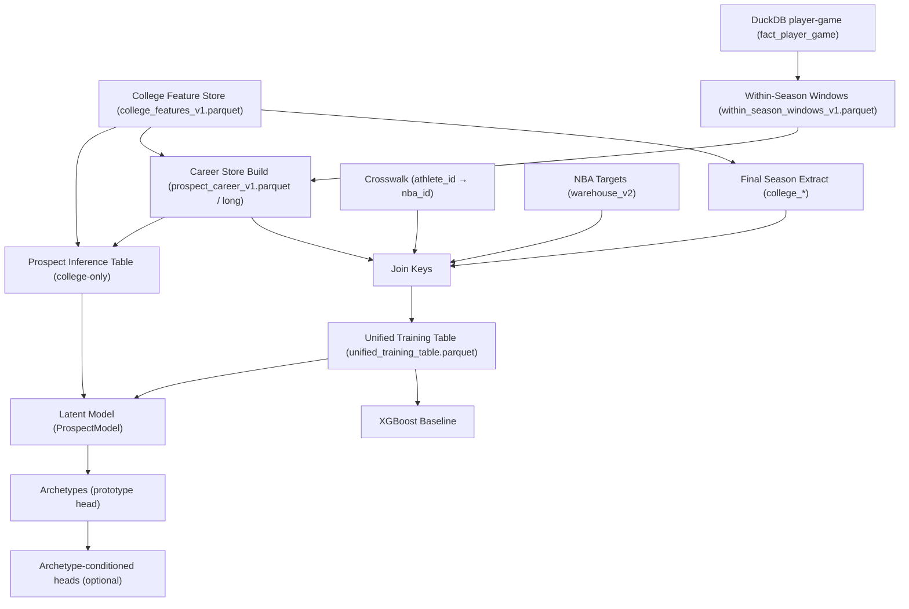

# End-to-End Wiring (College → Targets → Models)

**Date**: 2026-02-03  
**Status**: Current wiring + what is used vs not used

## What We’re Wiring Together

1. College features (all draft-time safe)  
2. Optional career progression (multi-season)  
3. Optional within-season breakout windows (late-season form)  
4. NBA targets (labels only)  
5. A latent model that can condition outcome heads on archetype assignments

## Player Linking (Identity)

Training linkage uses a crosswalk:

- `athlete_id` (college) → `nba_id` (NBA)
- Source file: `data/warehouse_v2/dim_player_nba_college_crosswalk.parquet`

Notes:
- `nba_id` is a join key only, never a feature.
- Players without an `nba_id` (current prospects, many UDFAs pre-NBA, international) are handled by the **inference path**, not the training path.

## What NBA Data We Use vs Don’t Use

We use NBA data only as **targets / supervision**:

- Primary: `y_peak_ovr` (peak 3-year RAPM) + components `y_peak_off`, `y_peak_def`
- Aux: `year1_epm_*`, `gap_ts_legacy`, `gap_usg_legacy` when available
- Survival label: `made_nba = (year1_mp >= 100)` (derived)

We do **not** use post-draft NBA performance stats as inputs (leakage risk). The explicit forbidden list lives in:
- `nba_scripts/nba_data_loader.py` (`FORBIDDEN_FEATURE_COLUMNS`)

## DAG (Training + Inference)

## Inference Path (UDFAs, Current Prospects, Missing nba_id)

Script:
- `nba_scripts/nba_prospect_inference.py`

It builds a college-only inference table (no nba_id required) and can run a trained model if provided.

## Boundary Cases (Design Intent)

- UDFAs / undrafted: training still works if they have an `nba_id` + targets; inference always works regardless.
- Transfers: multi-season career features are computed at athlete-season grain; within-season windows are per season.
- Missing historical player-game coverage: within-season windows remain `NaN` with `has_ws_* = 0`.

Validation:
- `college_scripts/utils/validate_within_season_windows_v1.py`
- `tests/test_wiring_edge_cases.py`

