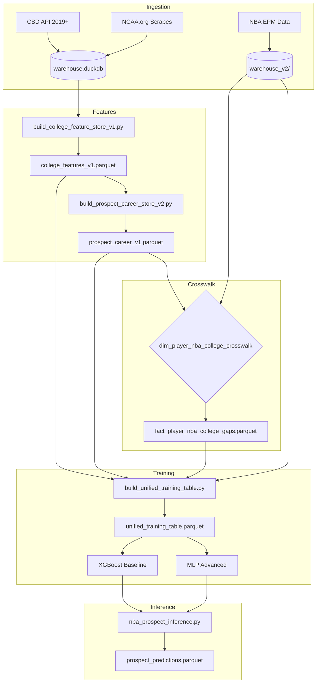

<!-- CANONICAL_HTML_MIRROR -->
# Markdown Mirror

This file is a mirror. Canonical visual artifact: `/Users/akashc/my-trankcopy/ml model/docs/diagrams/model_architecture_dashboard.html`

Summary: End-to-end architecture now maintained as canonical HTML dashboard.

Last mirror refresh: 2026-02-20 20:55:19


# Markdown Mirror

This file is a mirror. Canonical visual artifact: `/Users/akashc/my-trankcopy/ml model/docs/diagrams/model_architecture_dashboard.html`

Summary: End-to-end architecture now maintained as canonical HTML dashboard.

Last mirror refresh: 2026-02-20 20:52:26


# Markdown Mirror

This file is a mirror. Canonical visual artifact: `/Users/akashc/my-trankcopy/ml model/docs/diagrams/model_architecture_dashboard.html`

Summary: End-to-end architecture now maintained as canonical HTML dashboard.

Last mirror refresh: 2026-02-20 19:18:17


# Markdown Mirror

This file is a mirror. Canonical visual artifact: `/Users/akashc/my-trankcopy/ml model/docs/diagrams/model_architecture_dashboard.html`

Summary: End-to-end architecture now maintained as canonical HTML dashboard.

Last mirror refresh: 2026-02-20 11:52:26


# Markdown Mirror

This file is a mirror. Canonical visual artifact: `/Users/akashc/my-trankcopy/ml model/docs/diagrams/model_architecture_dashboard.html`

Summary: End-to-end architecture now maintained as canonical HTML dashboard.

Last mirror refresh: 2026-02-20 11:51:36


# Markdown Mirror

This file is a mirror. Canonical visual artifact: `/Users/akashc/my-trankcopy/ml model/docs/diagrams/model_architecture_dashboard.html`

Summary: End-to-end architecture now maintained as canonical HTML dashboard.

Last mirror refresh: 2026-02-20 11:50:14


# Markdown Mirror

This file is a mirror. Canonical visual artifact: `/Users/akashc/my-trankcopy/ml model/docs/diagrams/model_architecture_dashboard.html`

Summary: End-to-end architecture now maintained as canonical HTML dashboard.

Last mirror refresh: 2026-02-20 11:18:49


# Model Architecture DAG: NCAA → NBA Prospect Pipeline

**Version**: 1.0  
**Date**: 2026-01-29  
**Status**: Design Document

---

## Visual DAG (ASCII)

```
┌─────────────────────────────────────────────────────────────────────────────────────┐
│                              DATA INGESTION LAYER                                    │
├─────────────────────────────────────────────────────────────────────────────────────┤
│                                                                                      │
│   ┌──────────────────┐    ┌──────────────────┐    ┌──────────────────┐              │
│   │  CBD API (2019+) │    │ NCAA.org Scrapes │    │  NBA EPM Data    │              │
│   │  - Play-by-Play  │    │   (2010-2018)    │    │  - Year 1 Stats  │              │
│   │  - Shot X,Y      │    │  - Text PBP      │    │  - Peak RAPM     │              │
│   │  - Box Scores    │    │  - No Coords     │    │  - Minutes       │              │
│   └────────┬─────────┘    └────────┬─────────┘    └────────┬─────────┘              │
│            │                       │                       │                         │
│            ▼                       ▼                       ▼                         │
│   ┌──────────────────────────────────────────┐    ┌──────────────────┐              │
│   │           warehouse.duckdb               │    │  warehouse_v2/   │              │
│   │  - dim_teams, dim_players                │    │  - fact_player_  │              │
│   │  - fact_play_raw (2019+)                 │    │    year1_epm     │              │
│   │  - stg_shots (with X,Y)                  │    │  - fact_player_  │              │
│   └────────────────────┬─────────────────────┘    │    peak_rapm     │              │
│                        │                          └────────┬─────────┘              │
└────────────────────────┼───────────────────────────────────┼────────────────────────┘
                         │                                   │
                         ▼                                   │
┌─────────────────────────────────────────────────────────────────────────────────────┐
│                           FEATURE ENGINEERING LAYER                                  │
├─────────────────────────────────────────────────────────────────────────────────────┤
│                                                                                      │
│   ┌────────────────────────────────────────────────────────────────────────────┐    │
│   │                    build_college_feature_store_v1.py                        │    │
│   │  ┌─────────────────┐  ┌─────────────────┐  ┌─────────────────┐             │    │
│   │  │   TIER 1        │  │   TIER 2        │  │   IMPACT        │             │    │
│   │  │   (Universal)   │  │   (Spatial)     │  │   (RAPM)        │             │    │
│   │  │                 │  │                 │  │                 │             │    │
│   │  │ • rim_att/made  │  │ • avg_shot_dist │  │ • rapm_standard │             │    │
│   │  │ • mid_att/made  │  │ • shot_dist_var │  │ • o_rapm/d_rapm │             │    │
│   │  │ • three_att/made│  │ • corner_3_rate │  │ • rapm_leverage │             │    │
│   │  │ • ft_att/made   │  │ • deep_3_rate   │  │ • rapm_non_garb │             │    │
│   │  │ • assisted_*    │  │ • rim_purity    │  │                 │             │    │
│   │  │ • on_net_rating │  │                 │  │                 │             │    │
│   │  │                 │  │ GATING:         │  │                 │             │    │
│   │  │ 100% Coverage   │  │ xy_shots >= 25  │  │ 100% Coverage   │             │    │
│   │  │ 2010-2025       │  │ 2019+ only      │  │ 2010-2025       │             │    │
│   │  └─────────────────┘  └─────────────────┘  └─────────────────┘             │    │
│   └────────────────────────────────────────────────────────────────────────────┘    │
│                                      │                                               │
│                                      ▼                                               │
│   ┌────────────────────────────────────────────────────────────────────────────┐    │
│   │                    college_features_v1.parquet                              │    │
│   │                    Key: (athlete_id, season, split_id)                      │    │
│   └────────────────────────────────────────────────────────────────────────────┘    │
│                                      │                                               │
│                                      ▼                                               │
│   ┌────────────────────────────────────────────────────────────────────────────┐    │
│   │                    build_prospect_career_store_v2.py                        │    │
│   │                                                                             │    │
│   │  Aggregates multi-season college career into final features:                │    │
│   │  • final_trueShootingPct (last season TS%)                                  │    │
│   │  • final_usage (last season usage rate)                                     │    │
│   │  • career_years (number of college seasons)                                 │    │
│   │  • slope_* (improvement trends)                                             │    │
│   │  • career_wt_* (career-weighted averages)                                   │    │
│   └────────────────────────────────────────────────────────────────────────────┘    │
│                                      │                                               │
│                                      ▼                                               │
│   ┌────────────────────────────────────────────────────────────────────────────┐    │
│   │                    prospect_career_v1.parquet                               │    │
│   │                    Key: (athlete_id)                                        │    │
│   └────────────────────────────────────────────────────────────────────────────┘    │
│                                                                                      │
└─────────────────────────────────────────────────────────────────────────────────────┘
                                       │
                                       ▼
┌─────────────────────────────────────────────────────────────────────────────────────┐
│                              CROSSWALK LAYER                                         │
├─────────────────────────────────────────────────────────────────────────────────────┤
│                                                                                      │
│   ┌─────────────────────────┐         ┌─────────────────────────┐                   │
│   │   College Features      │         │   NBA Targets           │                   │
│   │   (athlete_id)          │         │   (nba_id)              │                   │
│   └───────────┬─────────────┘         └───────────┬─────────────┘                   │
│               │                                   │                                  │
│               │    ┌─────────────────────────┐    │                                  │
│               └───►│  dim_player_nba_college │◄───┘                                  │
│                    │      _crosswalk         │                                       │
│                    │                         │                                       │
│                    │  Fuzzy Name Matching:   │                                       │
│                    │  • First-letter block   │                                       │
│                    │  • Temporal constraints │                                       │
│                    │  • 45.3% match rate     │                                       │
│                    │  • 1,114 matched players│                                       │
│                    └───────────┬─────────────┘                                       │
│                                │                                                     │
│                                ▼                                                     │
│   ┌────────────────────────────────────────────────────────────────────────────┐    │
│   │                    fact_player_nba_college_gaps.parquet                     │    │
│   │                                                                             │    │
│   │  GAP = NBA_Metric - College_Metric (Translation Signal)                     │    │
│   │                                                                             │    │
│   │  • gap_ts_legacy: NBA Year-1 TS% - College Final TS% (859 players)          │    │
│   │  • gap_usg_legacy: NBA Year-1 Usage - College Final Usage (2 players)       │    │
│   │  • gap_rapm: NBA Peak RAPM - College RAPM (TBD)                             │    │
│   └────────────────────────────────────────────────────────────────────────────┘    │
│                                                                                      │
└─────────────────────────────────────────────────────────────────────────────────────┘
                                       │
                                       ▼
┌─────────────────────────────────────────────────────────────────────────────────────┐
│                         UNIFIED TRAINING TABLE                                       │
├─────────────────────────────────────────────────────────────────────────────────────┤
│                                                                                      │
│   ┌────────────────────────────────────────────────────────────────────────────┐    │
│   │                    build_unified_training_table.py                          │    │
│   │                                                                             │    │
│   │  INPUTS:                          OUTPUTS:                                  │    │
│   │  ├─ college_features_v1.parquet   ├─ unified_training_table.parquet         │    │
│   │  ├─ prospect_career_v1.parquet    │                                         │    │
│   │  ├─ crosswalk.parquet             │  Columns:                               │    │
│   │  ├─ fact_player_year1_epm         │  ├─ IDENTIFIERS                         │    │
│   │  ├─ fact_player_peak_rapm         │  │   • athlete_id, nba_id, name         │    │
│   │  └─ fact_player_gaps.parquet      │  │   • draft_year, college_final_season │    │
│   │                                   │  │                                      │    │
│   │  TRANSFORMS:                      │  ├─ FEATURES (X)                        │    │
│   │  ├─ Era normalization (z-score)   │  │   • Tier 1: 40+ columns              │    │
│   │  ├─ Logit for bounded rates       │  │   • Tier 2: 6 columns (masked)       │    │
│   │  ├─ Log for counts                │  │   • Career: 10+ columns              │    │
│   │  └─ Coverage masks                │  │   • Masks: has_spatial, has_athletic │    │
│   │                                   │  │                                      │    │
│   │                                   │  └─ TARGETS (Y)                         │    │
│   │                                   │      • gap_rapm (primary)               │    │
│   │                                   │      • gap_ts_legacy (auxiliary)        │    │
│   │                                   │      • year1_epm_tot (auxiliary)        │    │
│   │                                   │      • made_nba (binary)                │    │
│   └────────────────────────────────────────────────────────────────────────────┘    │
│                                                                                      │
└─────────────────────────────────────────────────────────────────────────────────────┘
                                       │
                                       ▼
┌─────────────────────────────────────────────────────────────────────────────────────┐
│                              MODEL TRAINING LAYER                                    │
├─────────────────────────────────────────────────────────────────────────────────────┤
│                                                                                      │
│   ┌─────────────────────────────────────────────────────────────────────────────┐   │
│   │                         WALK-FORWARD VALIDATION                              │   │
│   │                                                                              │   │
│   │   TRAIN (2010-2017)        VAL (2018-2019)         TEST (2020-2022)          │   │
│   │   ════════════════         ═══════════════         ═══════════════           │   │
│   │   ~15k player-seasons      ~4k player-seasons      ~5k player-seasons        │   │
│   │                                                                              │   │
│   │   ※ 2023-2025 EXCLUDED: Too recent for 3yr NBA targets                       │   │
│   └─────────────────────────────────────────────────────────────────────────────┘   │
│                                       │                                              │
│                                       ▼                                              │
│   ┌─────────────────────────────────────────────────────────────────────────────┐   │
│   │                              MODEL OPTIONS                                   │   │
│   │                                                                              │   │
│   │   ┌─────────────────────┐    ┌─────────────────────┐    ┌────────────────┐  │   │
│   │   │   BASELINE          │    │   ADVANCED (V1)     │    │  ADVANCED (V2) │  │   │
│   │   │   XGBoost           │    │   MLP               │    │  Transformer   │  │   │
│   │   │                     │    │                     │    │                │  │   │
│   │   │ • Multi-task via    │    │ • Shared encoder    │    │ • Attention    │  │   │
│   │   │   separate models   │    │ • Task-specific     │    │   over seasons │  │   │
│   │   │ • Feature importance│    │   heads             │    │ • Latent skill │  │   │
│   │   │ • Fast iteration    │    │ • Dropout for Tier2 │    │   embedding    │  │   │
│   │   │                     │    │   masking           │    │                │  │   │
│   │   │ Goal: RMSE < 2.0    │    │ Goal: Beat XGBoost  │    │ Goal: SOTA     │  │   │
│   │   └─────────────────────┘    └─────────────────────┘    └────────────────┘  │   │
│   └─────────────────────────────────────────────────────────────────────────────┘   │
│                                       │                                              │
│                                       ▼                                              │
│   ┌─────────────────────────────────────────────────────────────────────────────┐   │
│   │                           LOSS FUNCTION                                      │   │
│   │                                                                              │   │
│   │   L_total = w1 × MSE(gap_rapm)      [PRIMARY: Translation signal]            │   │
│   │           + w2 × MSE(gap_ts)        [AUXILIARY: Efficiency translation]      │   │
│   │           + w3 × MSE(year1_epm)     [AUXILIARY: Year-1 performance]          │   │
│   │           + w4 × BCE(made_nba)      [AUXILIARY: Survival/binary]             │   │
│   │                                                                              │   │
│   │   Heteroscedastic: Weight by exposure (variance ∝ 1/(minutes + ε))           │   │
│   └─────────────────────────────────────────────────────────────────────────────┘   │
│                                                                                      │
└─────────────────────────────────────────────────────────────────────────────────────┘
                                       │
                                       ▼
┌─────────────────────────────────────────────────────────────────────────────────────┐
│                              INFERENCE LAYER                                         │
├─────────────────────────────────────────────────────────────────────────────────────┤
│                                                                                      │
│   ┌─────────────────────────────────────────────────────────────────────────────┐   │
│   │                    nba_prospect_inference.py                                 │   │
│   │                                                                              │   │
│   │  INPUT:                                OUTPUT:                               │   │
│   │  ├─ Current season college features    ├─ predicted_gap_rapm                 │   │
│   │  ├─ Coverage masks                     ├─ predicted_gap_ts                   │   │
│   │  └─ Era normalization baselines        ├─ predicted_made_nba (prob)          │   │
│   │                                        │                                     │   │
│   │                                        │  DERIVED:                           │   │
│   │                                        │  ├─ predicted_nba_rapm =            │   │
│   │                                        │  │    college_rapm + gap_rapm       │   │
│   │                                        │  │                                  │   │
│   │                                        │  └─ Uncertainty Intervals:          │   │
│   │                                        │      [low, median, high]            │   │
│   │                                        │      "High Ceiling / Low Floor"     │   │
│   └─────────────────────────────────────────────────────────────────────────────┘   │
│                                                                                      │
└─────────────────────────────────────────────────────────────────────────────────────┘
```

---

## Data Flow Summary (Mermaid Format)



---

## File Dependency Graph

```
warehouse.duckdb
├── dim_teams
├── dim_players  
├── fact_play_raw (2019+)
└── stg_shots (X,Y coords)

data/manual_scrapes/{YEAR}/
└── Raw CSVs from NCAA.org (2010-2018)

data/college_feature_store/
├── college_features_v1.parquet     ← build_college_feature_store_v1.py
└── prospect_career_v1.parquet      ← build_prospect_career_store_v2.py

data/warehouse_v2/
├── dim_player_nba_college_crosswalk.parquet
├── fact_player_year1_epm.parquet
├── fact_player_peak_rapm.parquet
└── fact_player_nba_college_gaps.parquet

data/training/
└── unified_training_table.parquet  ← build_unified_training_table.py [NEW]

models/
└── nba_prospect_model_{DATE}/      ← train_baseline_xgboost.py [NEW]
    ├── model.json
    ├── feature_importance.csv
    └── eval_metrics.json
```

---

## Feature Categories (60+ Features)

### Tier 1: Universal (2010-2025, 100% Coverage)

| Category | Features | Count |
|----------|----------|-------|
| **Shot Profile** | rim_att, rim_made, rim_fg_pct, rim_share, mid_*, three_*, ft_* | 16 |
| **Creation** | assisted_share_rim, assisted_share_mid, assisted_share_three | 6 |
| **Leverage** | high_lev_att_rate, garbage_att_rate, leverage_poss_share | 3 |
| **Impact** | on_net_rating, on_ortg, on_drtg, rapm_standard, o_rapm, d_rapm | 6 |
| **Volume** | seconds_on, games_played, poss_on | 3 |
| **Context** | team_pace, is_power_conf, opp_rank | 3 |
| **Career** | final_ts, final_usage, career_years, slope_*, career_wt_* | 10 |

### Tier 2: Spatial (2019+, ~25% Coverage, Masked)

| Feature | Gating Threshold | Description |
|---------|------------------|-------------|
| avg_shot_dist | xy_shots >= 25 | Mean shot distance |
| shot_dist_var | xy_shots >= 25 | Shot distance variance |
| corner_3_rate | xy_3_shots >= 15 | Corner 3 attempt rate |
| deep_3_rate | xy_3_shots >= 15 | Deep 3 (27+ ft) attempt rate |
| rim_purity | xy_rim_shots >= 20 | Restricted area share of rim attempts |

### Coverage Masks

| Mask | Description |
|------|-------------|
| has_spatial_data | 1 if xy_shots >= 25, else 0 |
| has_athletic_testing | 1 if combine/pro day data exists |

---

## Target Variables

| Target | Formula | Coverage | Use |
|--------|---------|----------|-----|
| **gap_rapm** | NBA Peak RAPM - College RAPM | ~500 | Primary |
| **gap_ts_legacy** | NBA Y1 TS% - College Final TS% | 859 | Auxiliary |
| **year1_epm_tot** | NBA Year-1 EPM | ~1000 | Auxiliary |
| **made_nba** | 1 if NBA minutes >= 100 | ~1100 | Binary |

---

## Scripts to Create

1. **`nba_scripts/build_unified_training_table.py`** [NEW]
   - Merges all feature sources
   - Applies transforms (era normalization, logit, log)
   - Outputs `unified_training_table.parquet`

2. **`nba_scripts/train_baseline_xgboost.py`** [NEW]
   - Loads unified training table
   - Walk-forward split (train 2010-2017, val 2018-2019, test 2020-2022)
   - Multi-task: separate XGBoost for each target
   - Outputs model + feature importance + metrics

---

**Document Author**: cascade  
**Last Updated**: 2026-01-29
